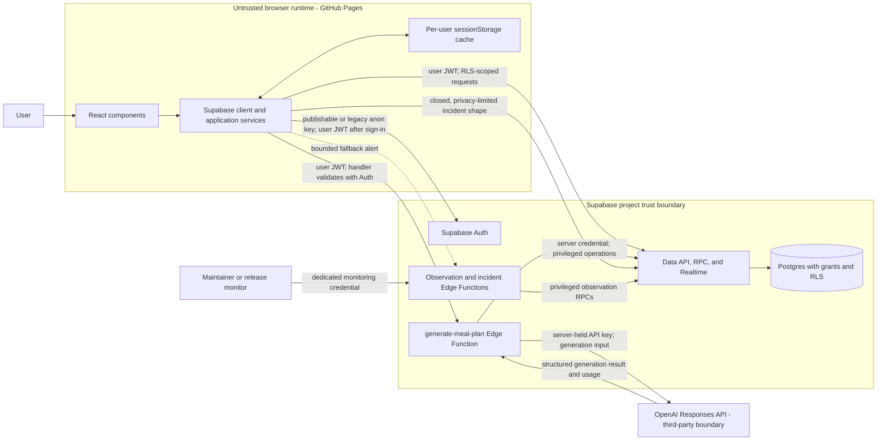
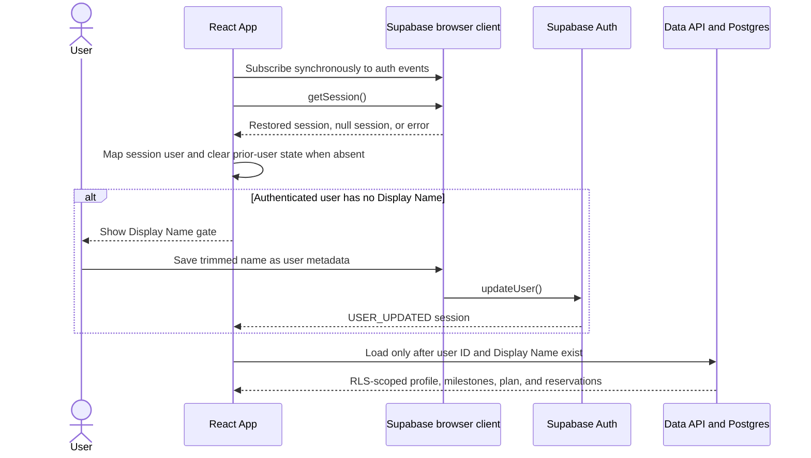

# System architecture and trust boundaries

**Audience:** NeuroNutrition maintainers and approved contributors.

**Purpose:** Explain the current runtime, trust, authentication, authorization,
and data-loading model well enough to change it safely.

This document describes internal responsibilities, not a supported public API.
Exact payloads, schemas, and function signatures remain implementation details
owned by the linked code and migrations. The [domain glossary](../CONTEXT.md)
owns product terms, while [deployment guidance](../DEPLOYMENT.md) owns operator
procedures and environment-specific verification.

## System context



The arrows describe allowed communication, not equal trust. Code, configuration,
and storage controlled by the browser can be inspected or changed by a user.
The browser therefore holds no server secret and cannot be the final authority
for identity, authorization, or the Current Weekly Plan.

## Runtime and trust boundaries

| Boundary | Responsibility | Security consequence |
| --- | --- | --- |
| Browser and GitHub Pages | Render the React application, restore a local session, collect user intent, validate response shapes, and present cached fallback state. | Treat all browser input, user IDs, metadata, cache entries, and public configuration as attacker-controlled. |
| Supabase Auth | Issue and refresh sessions, manage identities, and authenticate a bearer token when asked by the generation function. | A browser session can drive UI state, but server and database authorization must derive from a validated Supabase identity. |
| Data API, RPC, Realtime, and Postgres | Persist Health Profiles, milestones, Weekly Plans, commands, usage records, and limited incidents; apply grants, constraints, RLS, and RPC checks. | Client filters improve intent and efficiency; grants, RLS, and authenticated RPC logic enforce access. |
| Supabase Edge Functions | Validate each endpoint's caller, perform server-only orchestration, use privileged credentials where required, and keep provider secrets out of the browser. | A function with a server credential bypasses RLS and must establish authorization before privileged work. |
| OpenAI API | Generate structured meal-planning output and report provider usage. | Only the generation function calls OpenAI. The API key must remain server-side, and generation input crosses a third-party boundary. |
| Operator surfaces | Observe release identity, database invariants, function failures, and telemetry-delivery failure signals. | Monitoring uses credentials and endpoints distinct from an end-user session; it is not an application data path. |

## Frontend responsibilities

These modules are internal seams and may change without compatibility guarantees.

| Area | Current responsibility |
| --- | --- |
| [`App.tsx`](../App.tsx) | Coordinates session restoration, Display Name gating, user-bound data loading, authority status, Realtime invalidation, cache fallback, and clearing state on session changes. |
| [`components/`](../components) | Renders authentication, Display Name completion, plan, account, recovery, review, and feedback states. Components receive application actions; they do not establish database authority. |
| [`services/supabaseClient.ts`](../services/supabaseClient.ts) | Constructs the browser Supabase client from public configuration. The client persists and refreshes the browser session using Supabase's defaults. |
| [`services/authService.ts`](../services/authService.ts) | Wraps sign-in, OAuth, identity, Display Name, password, recovery, and local sign-out operations. |
| [`services/storageService.ts`](../services/storageService.ts) | Reads and writes the signed-in user's Health Profile and milestones through `user_data`. |
| [`services/weeklyPlanGateway.ts`](../services/weeklyPlanGateway.ts) | Reads the Current Weekly Plan and pending reservations, invokes client-authorized RPCs, validates returned ownership and shape, and subscribes to user-filtered invalidations. |
| [`services/weeklyPlanCache.ts`](../services/weeklyPlanCache.ts) | Stores one validated Current Weekly Plan snapshot per user in `sessionStorage`; it is optional, read-only fallback state, and cleared on relevant session transitions. |
| [`services/aiService.ts`](../services/aiService.ts) | Sends generation intent to `generate-meal-plan`; it never receives or stores the OpenAI API key. |
| [`services/clientIncidentTelemetry.ts`](../services/clientIncidentTelemetry.ts) | Sends allow-listed, length-limited operational context on a best-effort basis without changing application behavior or authority. |

## Authentication and session restoration



The browser calls `getSession()` to restore the locally persisted session and
listens to `onAuthStateChange` for initial, sign-in, sign-out, token-refresh,
recovery, and user-update events. The callback in `App.tsx` stays synchronous;
data loading happens in a separate effect. This matches current Supabase advice
to subscribe to auth events and avoids making another Supabase call from inside
the callback.

The locally restored session is sufficient to decide what loading state to show
in this browser. It is not sufficient for server authorization. Supabase notes
that `getSession()` reads attached storage; Postgres evaluates the request JWT
for RLS, and `generate-meal-plan` separately validates its bearer token with
Supabase Auth before any privileged work.

The Display Name is stored as user metadata and gates account-data loading in
the UI. It is presentation data, not an authorization claim: user metadata is
user-editable, and neither RLS nor an Edge Function grants access based on the
name. Until a non-empty name exists, the application renders only the Display
Name gate or logout path.

When the session becomes absent, `App.tsx` clears the previous user's profile,
milestones, plan, pending operations, refs, and cache entry before rendering
signed-out state. A newly authenticated user receives a user-keyed cache lookup
and a fresh data-loading cycle; in-flight loaders compare their captured user ID
with the currently loaded ID before applying a result. Postgres RLS remains the
authorization boundary for both paths.

Official references checked for this model:

- [Supabase JavaScript session retrieval](https://supabase.com/docs/reference/javascript/auth-getsession)
- [Supabase JavaScript auth events](https://supabase.com/docs/reference/javascript/auth-onauthstatechange)
- [Supabase user verification](https://supabase.com/docs/reference/javascript/auth-getuser)

## Authorization and storage

The browser uses `VITE_SUPABASE_URL` and `VITE_SUPABASE_ANON_KEY`. Despite the
legacy variable name, the example accepts either a publishable or legacy anon
key. This is public component configuration, not a secret and not a user
authorization mechanism. Supabase Auth adds the signed-in user's JWT; Postgres
then maps the request to `anon` or `authenticated` and evaluates grants and RLS.

Current storage boundaries are:

- `user_data` stores one user's Health Profile and milestones. Its select,
  insert, update, and delete policies compare `auth.uid()` with `user_id`.
- `weekly_plans` stores authoritative plan documents and revisions. Browser
  access is read-only and restricted to the authenticated owner by RLS.
- Weekly Plan mutation functions use explicit grants and authenticated caller
  checks. Some are `SECURITY DEFINER`; their implementations must retain their
  `auth.uid()` ownership checks, fixed search paths, and narrow execute grants
  because those functions can otherwise cross RLS.
- AI Usage Records and observation data are not a browser reporting API.
  Elevated server or dedicated monitoring roles receive the narrow grants they
  need; ordinary `anon` and `authenticated` table access is revoked.

Browser queries include the expected `user_id`, but that filter is not the
security boundary. RLS and RPC ownership checks are. Supabase's current guidance
likewise treats grants as object access and RLS as row access, and warns that a
publishable key is safe to expose only when database authorization is correctly
configured.

See the current schema history under [`supabase/migrations/`](../supabase/migrations)
and these official references:

- [Supabase API keys](https://supabase.com/docs/guides/getting-started/api-keys)
- [Securing the Supabase Data API](https://supabase.com/docs/guides/api/securing-your-api)
- [Supabase Row Level Security](https://supabase.com/docs/guides/database/postgres/row-level-security)

## Authoritative loading and cached fallback

```mermaid
sequenceDiagram
  participant App as React App
  participant Cache as Per-user sessionStorage
  participant Profile as user_data through RLS
  participant Plans as weekly_plans through RLS

  App->>Cache: Read key derived from authenticated user ID
  Cache-->>App: Validated matching snapshot or no snapshot
  App->>Profile: Load Health Profile and milestones
  App->>Plans: Load active Weekly Plan and reservations
  alt Server returns a valid plan
    Plans-->>App: Owner-matching authoritative row
    App->>Cache: Replace snapshot
    App->>App: Mark synchronized and enable valid actions
  else Server confirms no active plan
    Plans-->>App: Empty result
    App->>Cache: Clear snapshot
    App->>App: Mark confirmed-empty; initial generation may be offered
  else Request fails or response is invalid
    Plans-->>App: Error or rejected row
    App->>App: Show matching cache as stale and read-only, or unavailable
  end
```

Postgres is the authority for the Current Weekly Plan. The browser cache is a
privacy-conscious availability aid with these enforced limits:

1. Its key contains the authenticated user ID.
2. A cached row is accepted only when its shape is valid and its embedded owner
   matches that same user ID.
3. A stale cached plan remains visibly stale and plan-changing controls stay
   disabled while authority is checking or unavailable.
4. A cache miss or failure never means "no plan." Only an authoritative empty
   result sets `confirmed-empty` and permits initial generation.
5. A successful server response replaces the cache; confirmed empty and logout
   clear it. Realtime events are invalidation hints that trigger another
   authoritative read rather than supplying replacement state.

These client checks reduce accidental cross-user display. They complement, but
do not replace, RLS. Tests covering the behavior live in
[`App.authority.test.tsx`](../App.authority.test.tsx),
[`App.sessionRestore.test.tsx`](../App.sessionRestore.test.tsx), and
[`services/weeklyPlanGateway.test.ts`](../services/weeklyPlanGateway.test.ts).

## Edge Functions and privileged operations

[`supabase/config.toml`](../supabase/config.toml) deliberately sets
`verify_jwt = false` for all three functions because their handlers implement
different endpoint-specific authentication contracts. This does **not** make
the generation or observation operations anonymous.

### `generate-meal-plan`

The application endpoint requires an `Authorization: Bearer` token. Its
`requireAuthenticatedUser` function sends that token to Supabase Auth's
`/auth/v1/user` endpoint with the project client key and rejects missing,
expired, invalid, or userless responses before generation or privileged
database access. After authentication, the handler may use the server-held
service-role credential to read the saved Health Profile, call command RPCs,
and persist AI Usage Records. The same deployed function also exposes a
GET-only release-identity path protected by a separate hashed monitoring
credential, which is why one platform-level user-JWT rule does not cover every
route in the function.

Current Supabase guidance presents platform JWT verification plus
`@supabase/server` user authentication as the preferred user-only pattern and
also describes handler-controlled authentication for custom cases. The code
above is the deliberately implemented contract today. Changing it requires a
separate security change with tests and deployment verification; documentation
must not silently substitute a different pattern.

### Observation and incident endpoints

- `weekly-plan-observation` accepts only a dedicated high-entropy bearer token,
  compares its hash before selecting a probe, and then uses a server credential
  for narrowly granted observation RPCs.
- `client-incident-alert` is intentionally reachable without a user session
  because it is the last-resort signal when primary telemetry delivery fails.
  It reads no application data and writes no database row. For allowed browser
  origins the handler returns CORS headers; an absent or disallowed Origin does
  not itself reject the request. A small body limit, a closed payload shape, and
  a per-isolate rate cap bound processing before the handler emits a sanitized
  log and optional webhook alert.

See [Supabase authorization headers](https://supabase.com/docs/guides/functions/auth-headers)
and [Securing Edge Functions](https://supabase.com/docs/guides/functions/auth).

## OpenAI boundary

Only `generate-meal-plan` calls the OpenAI Responses API. It reads
`OPENAI_API_KEY` and the optional model override from Edge Function secrets,
constructs the prompt from the operation's Health Profile and relevant plan or
review context, requests schema-constrained JSON, validates the result, and
returns application data. The browser never calls OpenAI and never receives the
provider key.

OpenAI is a separate processor boundary: generation input leaves the Supabase
project, and the returned content is untrusted until application validation and
database constraints accept it. Provider response identifiers and measured
usage feed the server-side AI Usage Record path; they are not client authority.
OpenAI's current API guidance also requires API keys to remain out of browser
code and be loaded by a server-side environment or key-management service.

See the [OpenAI API authentication reference](https://platform.openai.com/docs/api-reference/authentication)
and [Responses API reference](https://platform.openai.com/docs/api-reference/responses).

## Configuration, secrets, and telemetry

| Category | Examples | Where it may exist |
| --- | --- | --- |
| Public client configuration | `VITE_SUPABASE_URL`, `VITE_SUPABASE_ANON_KEY`, release ID, provider feature flags, optional incident-alert URL | Browser bundle and local public environment configuration. These values grant no server privilege by themselves. |
| User credential | Supabase access and refresh session managed by `supabase-js` | Browser session storage and request headers; never documentation, logs, URLs, or issue reports. |
| Server secret | Supabase service-role or secret key, `OPENAI_API_KEY`, monitoring and webhook credentials | Edge Function secrets or protected automation secrets only; never `VITE_*`, source, browser storage, or public artifacts. |
| Privacy-limited client telemetry | Allow-listed event type plus short fields such as phase, operation, authority status, stable error code, provider name, or release ID | Restricted RPC; authenticated events are user-attributed, while only the signed-out OAuth failure event is accepted anonymously under a database rate cap. |
| Telemetry-delivery fallback | Event type, failed event name, and timestamps | Bounded public Edge Function, sanitized function log, and optional server-held webhook target. |

Client incident telemetry is best-effort: failure to report must never change
application authority or interrupt recovery. Context keys and lengths are
closed in both TypeScript and Postgres. Tokens, authorization codes, email
addresses, Health Profile values, free-form provider errors, and plan content
do not belong in this channel. A broader factual data inventory and deletion
limits are planned in [issue #74](https://github.com/cmilios/neuro-nutrition/issues/74);
until that guide exists, code and migrations remain the current evidence.

## Evidence and maintenance

This account was checked against current repository code, tests, configuration,
and migrations, plus official Supabase and OpenAI guidance, on 2026-08-09. It
does not claim that local configuration proves a hosted environment is ready.

Update this document whenever a change crosses a system or trust boundary,
moves responsibility between browser, database, function, or provider, changes
session restoration or Display Name gating, changes grants or RLS, changes
cache authority, adds a privileged operation, or changes secret or telemetry
handling. Add or supersede an ADR when the decision is durable, not merely an
implementation detail.

The authoritative Weekly Plan command lifecycle, recovery behavior, and legacy
rollout bridge are intentionally left for the next architecture slice. The
preferred runtime already imports the authority-first gateway; the transitional
bridge is not a competing source of truth in the main application bundle.
