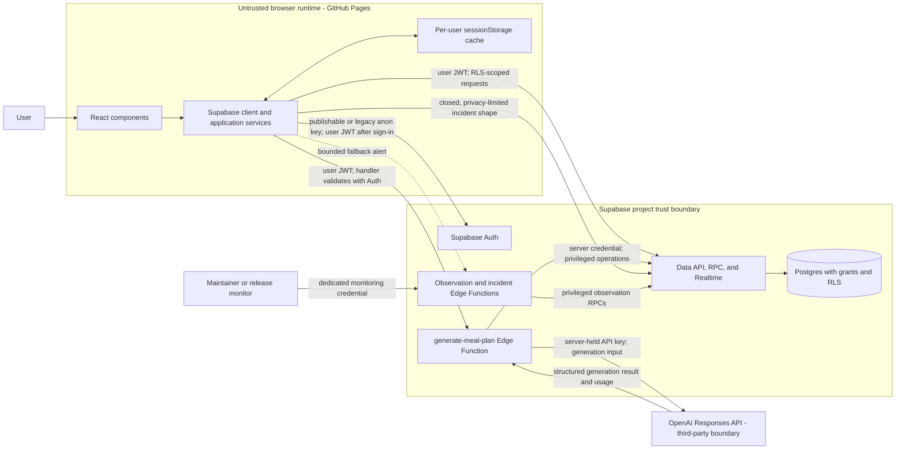
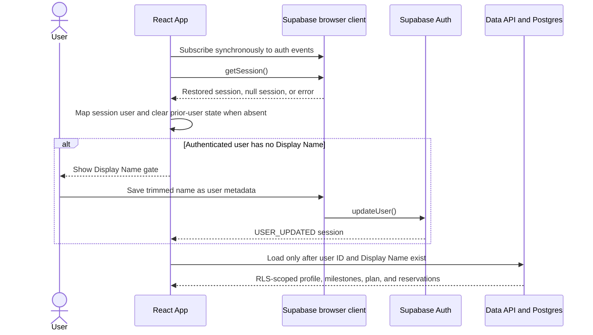
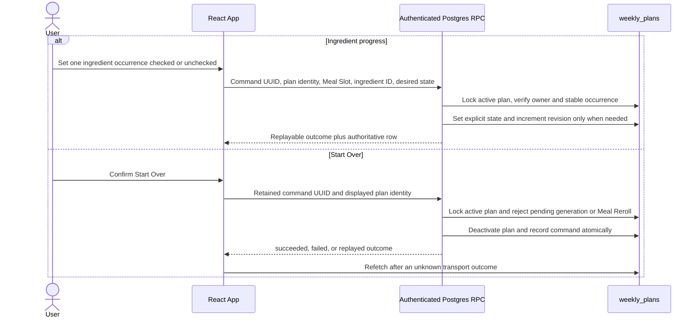

# System architecture and trust boundaries

**Audience:** NeuroNutrition maintainers and approved contributors.

**Purpose:** Explain the current runtime, trust, authentication, authorization,
and data-loading model well enough to change it safely.

This document describes internal responsibilities, not a supported public API.
Exact payloads, schemas, and function signatures remain implementation details
owned by the linked code and migrations. The [domain glossary](../CONTEXT.md)
owns product terms, while [deployment guidance](../DEPLOYMENT.md) owns operator
procedures and environment-specific verification.

## System context



The arrows describe allowed communication, not equal trust. Code, configuration,
and storage controlled by the browser can be inspected or changed by a user.
The browser therefore holds no server secret and cannot be the final authority
for identity, authorization, or the Current Weekly Plan.

## Runtime and trust boundaries

| Boundary | Responsibility | Security consequence |
| --- | --- | --- |
| Browser and GitHub Pages | Render the React application, restore a local session, collect user intent, validate response shapes, and present cached fallback state. | Treat all browser input, user IDs, metadata, cache entries, and public configuration as attacker-controlled. |
| Supabase Auth | Issue and refresh sessions, manage identities, and authenticate a bearer token when asked by the generation function. | A browser session can drive UI state, but server and database authorization must derive from a validated Supabase identity. |
| Data API, RPC, Realtime, and Postgres | Persist Health Profiles, milestones, Weekly Plans, commands, usage records, and limited incidents; apply grants, constraints, RLS, and RPC checks. | Client filters improve intent and efficiency; grants, RLS, and authenticated RPC logic enforce access. |
| Supabase Edge Functions | Validate each endpoint's caller, perform server-only orchestration, use privileged credentials where required, and keep provider secrets out of the browser. | A function with a server credential bypasses RLS and must establish authorization before privileged work. |
| OpenAI API | Generate structured meal-planning output and report provider usage. | Only the generation function calls OpenAI. The API key must remain server-side, and generation input crosses a third-party boundary. |
| Operator surfaces | Observe release identity, database invariants, function failures, and telemetry-delivery failure signals. | Monitoring uses credentials and endpoints distinct from an end-user session; it is not an application data path. |

## Frontend responsibilities

These modules are internal seams and may change without compatibility guarantees.

| Area | Current responsibility |
| --- | --- |
| [`App.tsx`](../App.tsx) | Coordinates session restoration, Display Name gating, user-bound data loading, authority status, Realtime invalidation, cache fallback, and clearing state on session changes. |
| [`components/`](../components) | Renders authentication, Display Name completion, plan, account, recovery, review, and feedback states. Components receive application actions; they do not establish database authority. |
| [`services/supabaseClient.ts`](../services/supabaseClient.ts) | Constructs the browser Supabase client from public configuration. The client persists and refreshes the browser session using Supabase's defaults. |
| [`services/authService.ts`](../services/authService.ts) | Wraps sign-in, OAuth, identity, Display Name, password, recovery, and local sign-out operations. |
| [`services/storageService.ts`](../services/storageService.ts) | Reads and writes the signed-in user's Health Profile and milestones through `user_data`. |
| [`services/weeklyPlanGateway.ts`](../services/weeklyPlanGateway.ts) | Reads the Current Weekly Plan and pending reservations, invokes client-authorized RPCs, validates returned ownership and shape, and subscribes to user-filtered invalidations. |
| [`services/weeklyPlanCache.ts`](../services/weeklyPlanCache.ts) | Stores one validated Current Weekly Plan snapshot per user in `sessionStorage`; it is optional, read-only fallback state, and cleared on relevant session transitions. |
| [`services/aiService.ts`](../services/aiService.ts) | Sends generation intent to `generate-meal-plan`; it never receives or stores the OpenAI API key. |
| [`services/clientIncidentTelemetry.ts`](../services/clientIncidentTelemetry.ts) | Sends allow-listed, length-limited operational context on a best-effort basis without changing application behavior or authority. |

## Authentication and session restoration



The browser calls `getSession()` to restore the locally persisted session and
listens to `onAuthStateChange` for initial, sign-in, sign-out, token-refresh,
recovery, and user-update events. The callback in `App.tsx` stays synchronous;
data loading happens in a separate effect. This matches current Supabase advice
to subscribe to auth events and avoids making another Supabase call from inside
the callback.

The locally restored session is sufficient to decide what loading state to show
in this browser. It is not sufficient for server authorization. Supabase notes
that `getSession()` reads attached storage; Postgres evaluates the request JWT
for RLS, and `generate-meal-plan` separately validates its bearer token with
Supabase Auth before any privileged work.

The Display Name is stored as user metadata and gates account-data loading in
the UI. It is presentation data, not an authorization claim: user metadata is
user-editable, and neither RLS nor an Edge Function grants access based on the
name. Until a non-empty name exists, the application renders only the Display
Name gate or logout path.

When the session becomes absent, `App.tsx` clears the previous user's profile,
milestones, plan, pending operations, refs, and cache entry before rendering
signed-out state. A newly authenticated user receives a user-keyed cache lookup
and a fresh data-loading cycle; in-flight loaders compare their captured user ID
with the currently loaded ID before applying a result. Postgres RLS remains the
authorization boundary for both paths.

Official references checked for this model:

- [Supabase JavaScript session retrieval](https://supabase.com/docs/reference/javascript/auth-getsession)
- [Supabase JavaScript auth events](https://supabase.com/docs/reference/javascript/auth-onauthstatechange)
- [Supabase user verification](https://supabase.com/docs/reference/javascript/auth-getuser)

## Authorization and storage

The browser uses `VITE_SUPABASE_URL` and `VITE_SUPABASE_ANON_KEY`. Despite the
legacy variable name, the example accepts either a publishable or legacy anon
key. This is public component configuration, not a secret and not a user
authorization mechanism. Supabase Auth adds the signed-in user's JWT; Postgres
then maps the request to `anon` or `authenticated` and evaluates grants and RLS.

Current storage boundaries are:

- `user_data` stores one user's Health Profile and milestones. Its select,
  insert, update, and delete policies compare `auth.uid()` with `user_id`.
- `weekly_plans` stores authoritative plan documents and revisions. Browser
  access is read-only and restricted to the authenticated owner by RLS.
- Weekly Plan mutation functions use explicit grants and authenticated caller
  checks. Some are `SECURITY DEFINER`; their implementations must retain their
  `auth.uid()` ownership checks, fixed search paths, and narrow execute grants
  because those functions can otherwise cross RLS.
- AI Usage Records and observation data are not a browser reporting API.
  Elevated server or dedicated monitoring roles receive the narrow grants they
  need; ordinary `anon` and `authenticated` table access is revoked.

Browser queries include the expected `user_id`, but that filter is not the
security boundary. RLS and RPC ownership checks are. Supabase's current guidance
likewise treats grants as object access and RLS as row access, and warns that a
publishable key is safe to expose only when database authorization is correctly
configured.

See the current schema history under [`supabase/migrations/`](../supabase/migrations)
and these official references:

- [Supabase API keys](https://supabase.com/docs/guides/getting-started/api-keys)
- [Securing the Supabase Data API](https://supabase.com/docs/guides/api/securing-your-api)
- [Supabase Row Level Security](https://supabase.com/docs/guides/database/postgres/row-level-security)

## Authoritative loading and cached fallback

```mermaid
sequenceDiagram
  participant App as React App
  participant Cache as Per-user sessionStorage
  participant Profile as user_data through RLS
  participant Plans as weekly_plans through RLS

  App->>Cache: Read key derived from authenticated user ID
  Cache-->>App: Validated matching snapshot or no snapshot
  App->>Profile: Load Health Profile and milestones
  App->>Plans: Load active Weekly Plan and reservations
  alt Server returns a valid plan
    Plans-->>App: Owner-matching authoritative row
    App->>Cache: Replace snapshot
    App->>App: Mark synchronized and enable valid actions
  else Server confirms no active plan
    Plans-->>App: Empty result
    App->>Cache: Clear snapshot
    App->>App: Mark confirmed-empty; initial generation may be offered
  else Request fails or response is invalid
    Plans-->>App: Error or rejected row
    App->>App: Show matching cache as stale and read-only, or unavailable
  end
```

Postgres is the authority for the Current Weekly Plan. The browser cache is a
privacy-conscious availability aid with these enforced limits:

1. Its key contains the authenticated user ID.
2. A cached row is accepted only when its shape is valid and its embedded owner
   matches that same user ID.
3. A stale cached plan remains visibly stale and plan-changing controls stay
   disabled while authority is checking or unavailable.
4. A cache miss or failure never means "no plan." Only an authoritative empty
   result sets `confirmed-empty` and permits initial generation.
5. A successful server response replaces the cache; confirmed empty and logout
   clear it. Realtime events are invalidation hints that trigger another
   authoritative read rather than supplying replacement state.

These client checks reduce accidental cross-user display. They complement, but
do not replace, RLS. Tests covering the behavior live in
[`App.authority.test.tsx`](../App.authority.test.tsx),
[`App.sessionRestore.test.tsx`](../App.sessionRestore.test.tsx), and
[`services/weeklyPlanGateway.test.ts`](../services/weeklyPlanGateway.test.ts).

## Authoritative Weekly Plan lifecycle

The active row in `weekly_plans` is the Current Weekly Plan. Browser state,
request payloads, Realtime events, and the cache may describe or invalidate
that row, but none may replace it. Provider-backed changes use durable command
rows so that a browser retry can repeat one intent without authorizing a second
billable operation. Database-only changes use the same command identity and
replay principle without pretending that provider work occurred.

| Flow | Authoritative precondition | Concurrency boundary | Successful result |
| --- | --- | --- | --- |
| Initial generation | An authoritative read confirmed that no active plan exists. | One pending initial-generation command per user; no placeholder plan is created. | Insert one active revision-0 plan with the command as its generation identity. |
| Meal Reroll | The server resolves the authenticated user's active plan and selected Meal Slot. | A durable reservation protects that Meal Slot; generation-wide changes wait for reservations to clear. | Replace only the reserved meal and increment the active plan revision once. |
| Next Weekly Plan | The submitted source identity resolves to the active plan and revision. | The active row carries the generation command and lock time; conflicting mutations are rejected. | Deactivate the source and insert one active revision-0 successor linked by `predecessor_plan_id`. |
| Health Profile Plan Replacement | The submitted source is active and the saved plan-relevant Health Profile is available. | A separate replacement command and source-row lock reject conflicting mutations. | Keep the source active during generation, then atomically replace it with a revision-0 successor. |
| Ingredient progress | The target occurrence belongs to an active authoritative plan. | One idempotent database command sets an explicit checked state; generation locks reject it. | Update one stable ingredient occurrence and increment the plan revision once when state changes. |
| Start Over | The displayed plan still resolves to the user's active plan and no generation or Meal Reroll is pending. | The database locks the active row and records the command in the same transaction. | Deactivate the Current Weekly Plan; preserve its history and all unrelated user data. |

### Durable provider command protocol

Initial generation, Meal Reroll, Next Weekly Plan, and Health Profile Plan
Replacement share this server-side shape. Their command ID is a UUID created at
the user-intent boundary. The database binds it to the authenticated user,
operation, and a privacy-safe input fingerprint. Reusing an ID with different
input fails; replaying the same identity returns its recorded state.

```mermaid
sequenceDiagram
  actor User
  participant App as React App
  participant Edge as generate-meal-plan
  participant Commands as Command RPCs and Postgres
  participant OpenAI as OpenAI Responses API

  User->>App: Request one Weekly Plan change
  App->>App: Create or retain command UUID
  App->>Edge: Intent plus command ID and source identity
  Edge->>Commands: Begin and reserve or lock authoritative state
  alt Recorded command or conflicting work
    Commands-->>Edge: succeeded, failed, or in_progress; shouldGenerate=false
  else This command owns provider work
    Commands-->>Edge: in_progress; shouldGenerate=true
    Edge->>OpenAI: One attributed generation attempt
    OpenAI-->>Edge: Result, known failure, or uncertain transport outcome
    Edge->>Commands: Immutable success, failure, or unknown checkpoint
    Edge->>Commands: Persist AI Usage Record
    alt Success checkpoint
      Edge->>Commands: Complete atomically
      Commands-->>Edge: succeeded plus authoritative row
    else Known terminal failure
      Edge->>Commands: Fail and release reservation or lock
      Commands-->>Edge: failed plus safe evidence
    else Unknown provider outcome
      Edge-->>App: 503; command remains in_progress
      App->>Edge: Retry the same command identity
      Edge->>Commands: Replay checkpoint; never call provider again
    end
  end
  Edge-->>App: Recorded command outcome
  App->>Commands: Refetch authoritative plan when outcome is unclear
```

A provider result is checkpointed before command completion. This ordering lets
a retry finish a known success without a second provider call. AI usage is
persisted before the checkpoint is finalized; if attribution cannot be made
durable, the command stays pending rather than publishing unaccounted output.
Only the database completion transaction may publish a new plan or revision.

An `unknown` checkpoint means the provider request may have crossed the
third-party boundary but no safe result is available. It must never authorize
another provider attempt under either the same or a new command while the old
reservation or lock remains. The browser keeps the command identity when it can,
marks the displayed plan read-only, and refetches authoritative state.

### Initial Current Weekly Plan generation

```mermaid
sequenceDiagram
  actor User
  participant App as React App
  participant Plans as weekly_plans
  participant Edge as generate-meal-plan
  participant Commands as initial command RPCs
  participant OpenAI as OpenAI

  App->>Plans: Read active plan for authenticated user
  Plans-->>App: Confirmed empty
  User->>App: Submit Health Profile
  App->>Edge: profile plus retained command UUID
  Edge->>Commands: Begin only if user still has no active plan
  Commands-->>Edge: Pending command; no placeholder plan
  Edge->>OpenAI: Generate from submitted Health Profile
  OpenAI-->>Edge: Result or failure
  Edge->>Commands: Checkpoint provider outcome and usage
  alt Valid result
    Edge->>Commands: Complete
    Commands->>Plans: Insert one active revision-0 plan
    Commands-->>App: succeeded plus authoritative row
  else Known failure
    Edge->>Commands: Fail
    Commands-->>App: failed; authoritative state remains empty
  else Unknown transport outcome
    Edge-->>App: 503; command remains pending
    App->>Edge: User retry reuses command UUID while page state survives
    Edge->>Commands: Replay without another provider call
    App->>Commands: Rediscover owner-scoped pending command and request recovery
    Commands-->>App: Repair a committed plan, or terminally fail after the stale threshold
  end
```

The UI offers this flow only after `getCurrent` returns authoritative empty. A
cache miss, rejected row, timeout, or failed request leaves generation disabled.
The command RPC repeats the empty-state check, so a stale browser cannot create
a second active plan. The Health Profile draft stays in browser state for retry;
the ordinary profile save currently follows successful plan publication.

### Meal Reroll

```mermaid
sequenceDiagram
  actor User
  participant App as React App
  participant Edge as generate-meal-plan
  participant Commands as Meal Reroll RPCs
  participant Plans as weekly_plans and reservations
  participant OpenAI as OpenAI

  User->>App: Reroll one Meal Slot
  App->>Edge: command UUID, displayed plan and revision, day, meal type
  Edge->>Commands: Begin
  Commands->>Plans: Resolve active server meal and reserve only its slot
  Commands-->>Edge: Authoritative source meal
  Edge->>OpenAI: Generate same type, excluding Same Meal
  OpenAI-->>Edge: Candidate and usage
  Edge->>Edge: Validate shape, type, and difference; at most two attempts
  Edge->>Commands: Checkpoint result
  alt Valid replacement
    Edge->>Commands: Complete
    Commands->>Plans: Replace one meal, assign server ingredient IDs, increment revision, remove reservation
  else Known failure
    Edge->>Commands: Fail and remove reservation
  else Unknown outcome
    Edge-->>App: 503; reservation remains visible through read and Realtime paths
    App->>Edge: Immediate replay or user retry with same command UUID
    Edge->>Commands: Replay without another provider call
    App->>Commands: Rediscover reservation and request recovery
    Commands-->>App: Replay a durable checkpoint, or terminally release the reservation
  end
  Commands-->>App: Outcome plus full authoritative row when succeeded
```

The browser deliberately does not supply the meal document to mutate. Pending
reservations are presentation and exclusion signals, not authority; their
server row is what prevents duplicate work on that Meal Slot. Completion
returns the entire validated authoritative row so the client does not splice a
provider response into local state.

### Next Weekly Plan

```mermaid
sequenceDiagram
  actor User
  participant App as React App
  participant Edge as generate-meal-plan
  participant Commands as Next Weekly Plan RPCs
  participant Plans as weekly_plans
  participant OpenAI as OpenAI

  User->>App: Submit Meal Review and request next week
  App->>Edge: review, command UUID, displayed source identity
  Edge->>Commands: Begin
  Commands->>Plans: Lock active source and return its authoritative document
  Edge->>OpenAI: Generate from source, review, and variety rules
  OpenAI-->>Edge: Candidate and usage
  Edge->>Edge: Validate retention, movement, and variety; at most two attempts
  Edge->>Commands: Checkpoint validated result or failure
  alt Valid successor
    Edge->>Commands: Complete atomically
    Commands->>Plans: Deactivate source and insert linked revision-0 successor
  else Known failure
    Edge->>Commands: Fail and clear source lock
  else Unknown outcome
    Edge-->>App: 503; source remains active, visible, and read-only
    App->>Edge: Retry same command identity
    Edge->>Commands: Replay checkpoint without provider work
    App->>Commands: Rediscover source lock and request recovery
    Commands-->>App: Replay a durable checkpoint, repair a successor, or terminally release the lock
  end
  Commands-->>App: Outcome plus successor when succeeded
```

The Edge Function ignores browser plan content as write authority and generates
from the source document returned by the lock transaction. Next Weekly Plan is
the only flow that applies Meal Review retention and variety rules. Its source
remains the Current Weekly Plan until completion; failure never publishes a
partial successor.

### Health Profile Plan Replacement

```mermaid
sequenceDiagram
  actor User
  participant App as React App
  participant Profile as user_data
  participant Edge as generate-meal-plan
  participant Commands as replacement RPCs
  participant Plans as weekly_plans
  participant OpenAI as OpenAI

  User->>App: Save plan-relevant Health Profile and replace plan
  App->>Profile: Save updated Health Profile
  App->>Edge: command UUID and displayed source identity
  Edge->>Profile: Load saved Health Profile server-side
  Edge->>Commands: Begin and lock active source
  Edge->>OpenAI: Generate normally; no Meal Review retention rules
  OpenAI-->>Edge: Candidate and usage
  Edge->>Commands: Checkpoint outcome
  alt Valid replacement
    Edge->>Commands: Complete atomically
    Commands->>Plans: Deactivate source and insert linked revision-0 successor
  else Known failure
    Edge->>Commands: Fail and clear lock
    Plans-->>App: Previous plan remains current
  else Unknown or interrupted outcome
    Edge-->>App: 503 or in_progress
    App->>Edge: Replay locked command every 60 seconds
    Edge->>Commands: Recover stale command
    alt Successor already committed
      Commands-->>App: Replay succeeded result
    else No committed result after stale threshold
      Commands-->>App: Retryable failure; clear lock
      App->>Edge: Retry once with a new command UUID
    end
  end
```

Saving the Health Profile and replacing the plan are separate effects: a failed
replacement does not roll back the saved profile, and the previous plan remains
current. On a normal first attempt, the Edge Function reloads the saved profile
instead of trusting browser profile JSON. A resumed locked command uses its
persisted fingerprint so later profile edits cannot silently change its intent.

### Ingredient progress and Start Over

Neither operation calls OpenAI. They are authoritative database mutations and
must not be forced into the provider command sequence merely for symmetry.



Ingredient progress uses server-assigned occurrence identities so repeated
ingredient labels remain independent. Setting an already-equal state is an
idempotent success. Start Over deactivates the plan rather than deleting it and
preserves the Health Profile, milestones, AI Usage Records, and inactive plan
history. Once an authoritative read confirms empty, the ordinary initial
generation gate applies again.

### Recovery contract and limits

Initial generation, Meal Reroll, and Next Weekly Plan now use the same recovery
contract. The browser rediscovers the durable command ID from an owner-scoped
pending-command RPC, the Meal Slot reservation, or the Current Weekly Plan
lock, respectively. It asks the Edge Function to recover that exact command;
the Edge Function calls a service-only recovery RPC and never recomputes the
input fingerprint or authorizes provider work during recovery.

A durable success or failure checkpoint remains available for ordinary replay.
After ten minutes, an `unknown` or missing checkpoint is reconciled only from
database authority. A committed plan is repaired into a succeeded command. If
no result was committed, the command becomes the non-retryable
`provider_outcome_unrecoverable` terminal state, the lock or reservation is
released, and sanitized evidence records only the recovery stage and stable
reason. The browser refetches authority; it does not automatically create a
fresh command. A later explicit user action is a new intent with a new command
ID.

This limit is deliberate because provider requests use `store: false`: an
unknown transport result cannot be fetched later without retaining sensitive
provider output. Realtime and cache state remain invalidation and display aids,
not recovery evidence. The observation snapshot reports recent repaired and
unrecoverable terminal recoveries, while stale command, lock, and reservation
counts continue to fail the operational gate.

### Transitional rollout and legacy persistence

The preferred architecture is the authority-first gateway and the authoritative
database lifecycle above. [`services/weeklyPlanBridge.ts`](../services/weeklyPlanBridge.ts)
and the rollout migrations exist only to make the historical cutover observable
and fail closed:

- `legacy` reports that older persistence still owns the environment;
- `maintenance` disables Weekly Plan changes during migration;
- `authoritative` enables the command and `weekly_plans` paths.

The Edge Function checks this state before provider work. The main application
imports the authoritative gateway, not the bridge as an alternate write path.
Legacy local storage and migration commands are compatibility evidence, not a
supported fallback and not a second source of truth. New lifecycle work should
extend authoritative tables, RPCs, and command tests rather than add another
client persistence path.

### Lifecycle evidence map

| Claim area | Current evidence |
| --- | --- |
| Authority and cache gate | [`App.authority.test.tsx`](../App.authority.test.tsx), [`services/weeklyPlanGateway.ts`](../services/weeklyPlanGateway.ts), [`services/weeklyPlanCache.ts`](../services/weeklyPlanCache.ts) |
| Initial generation | [`initial generation handler tests`](../supabase/functions/generate-meal-plan/initialGeneration.test.ts), [`initial command migration`](../supabase/migrations/20260727130000_create_initial_generation_commands.sql), [`migration tests`](../supabase/migrations/initial_generation_commands.test.ts) |
| Meal Reroll | [`Meal Reroll handler tests`](../supabase/functions/generate-meal-plan/mealReroll.test.ts), [`Meal Reroll migration`](../supabase/migrations/20260727150000_create_meal_reroll_commands.sql), [`migration tests`](../supabase/migrations/meal_reroll_commands.test.ts) |
| Next Weekly Plan | [`App.nextGeneration.test.tsx`](../App.nextGeneration.test.tsx), [`handler tests`](../supabase/functions/generate-meal-plan/nextGenerationCommand.test.ts), [`Next Weekly Plan migration`](../supabase/migrations/20260727160000_create_next_weekly_plan_commands.sql), [`migration tests`](../supabase/migrations/next_weekly_plan_commands.test.ts) |
| Health Profile Plan Replacement | [`replacement handler tests`](../supabase/functions/generate-meal-plan/healthProfileReplacement.test.ts), [`replacement migration`](../supabase/migrations/20260730062107_create_health_profile_plan_replacement_commands.sql), [`migration tests`](../supabase/migrations/health_profile_plan_replacement_commands.test.ts) |
| Ingredient progress and Start Over | [`ingredient migration`](../supabase/migrations/20260727140000_create_ingredient_progress_commands.sql), [`ingredient command tests`](../supabase/migrations/ingredient_progress_commands.test.ts), [`Start Over migration`](../supabase/migrations/20260727170000_create_start_over_commands.sql), [`App.startOver.test.tsx`](../App.startOver.test.tsx), [`Start Over migration tests`](../supabase/migrations/start_over_weekly_plan_commands.test.ts) |
| Provider checkpoint and server orchestration | [`handler.ts`](../supabase/functions/generate-meal-plan/handler.ts), [`persistence.ts`](../supabase/functions/generate-meal-plan/persistence.ts); [ADR-0001](adr/0001-record-per-user-ai-usage.md) owns AI Usage Record attribution only |
| Transitional rollout | [`weeklyPlanBridge.ts`](../services/weeklyPlanBridge.ts), [`legacy cutover tests`](../supabase/migrations/legacy_weekly_plan_cutover.test.ts), [`weekly plan observation tests`](../supabase/migrations/weekly_plan_observation.test.ts) |

## Edge Functions and privileged operations

[`supabase/config.toml`](../supabase/config.toml) deliberately sets
`verify_jwt = false` for all three functions because their handlers implement
different endpoint-specific authentication contracts. This does **not** make
the generation or observation operations anonymous.

### `generate-meal-plan`

The application endpoint requires an `Authorization: Bearer` token. Its
`requireAuthenticatedUser` function sends that token to Supabase Auth's
`/auth/v1/user` endpoint with the project client key and rejects missing,
expired, invalid, or userless responses before generation or privileged
database access. After authentication, the handler may use the server-held
service-role credential to read the saved Health Profile, call command RPCs,
and persist AI Usage Records. The same deployed function also exposes a
GET-only release-identity path protected by a separate hashed monitoring
credential, which is why one platform-level user-JWT rule does not cover every
route in the function.

Current Supabase guidance presents platform JWT verification plus
`@supabase/server` user authentication as the preferred user-only pattern and
also describes handler-controlled authentication for custom cases. The code
above is the deliberately implemented contract today. Changing it requires a
separate security change with tests and deployment verification; documentation
must not silently substitute a different pattern.

### Observation and incident endpoints

- `weekly-plan-observation` accepts only a dedicated high-entropy bearer token,
  compares its hash before selecting a probe, and then uses a server credential
  for narrowly granted observation RPCs.
- `client-incident-alert` is intentionally reachable without a user session
  because it is the last-resort signal when primary telemetry delivery fails.
  It reads no application data and writes no database row. For allowed browser
  origins the handler returns CORS headers; an absent or disallowed Origin does
  not itself reject the request. A small body limit, a closed payload shape, and
  a per-isolate rate cap bound processing before the handler emits a sanitized
  log and optional webhook alert.

See [Supabase authorization headers](https://supabase.com/docs/guides/functions/auth-headers)
and [Securing Edge Functions](https://supabase.com/docs/guides/functions/auth).

## OpenAI boundary

Only `generate-meal-plan` calls the OpenAI Responses API. It reads
`OPENAI_API_KEY` and the optional model override from Edge Function secrets,
constructs the prompt from the operation's Health Profile and relevant plan or
review context, requests schema-constrained JSON, validates the result, and
returns application data. The browser never calls OpenAI and never receives the
provider key.

OpenAI is a separate processor boundary: generation input leaves the Supabase
project, and the returned content is untrusted until application validation and
database constraints accept it. Provider response identifiers and measured
usage feed the server-side AI Usage Record path; they are not client authority.
OpenAI's current API guidance also requires API keys to remain out of browser
code and be loaded by a server-side environment or key-management service.

See the [OpenAI API authentication reference](https://platform.openai.com/docs/api-reference/authentication)
and [Responses API reference](https://platform.openai.com/docs/api-reference/responses).

## Configuration, secrets, and telemetry

| Category | Examples | Where it may exist |
| --- | --- | --- |
| Public client configuration | `VITE_SUPABASE_URL`, `VITE_SUPABASE_ANON_KEY`, release ID, provider feature flags, optional incident-alert URL | Browser bundle and local public environment configuration. These values grant no server privilege by themselves. |
| User credential | Supabase access and refresh session managed by `supabase-js` | Browser session storage and request headers; never documentation, logs, URLs, or issue reports. |
| Server secret | Supabase service-role or secret key, `OPENAI_API_KEY`, monitoring and webhook credentials | Edge Function secrets or protected automation secrets only; never `VITE_*`, source, browser storage, or public artifacts. |
| Privacy-limited client telemetry | Allow-listed event type plus short fields such as phase, operation, authority status, stable error code, provider name, or release ID | Restricted RPC; authenticated events are user-attributed, while only the signed-out OAuth failure event is accepted anonymously under a database rate cap. |
| Telemetry-delivery fallback | Event type, failed event name, and timestamps | Bounded public Edge Function, sanitized function log, and optional server-held webhook target. |

Client incident telemetry is best-effort: failure to report must never change
application authority or interrupt recovery. Context keys and lengths are
closed in both TypeScript and Postgres. Tokens, authorization codes, email
addresses, Health Profile values, free-form provider errors, and plan content
do not belong in this channel. A broader factual data inventory and deletion
limits are planned in [issue #74](https://github.com/cmilios/neuro-nutrition/issues/74);
until that guide exists, code and migrations remain the current evidence.

## Evidence and maintenance

This account was checked against current repository code, tests, configuration,
and migrations, plus official Supabase and OpenAI guidance, on 2026-08-09. It
does not claim that local configuration proves a hosted environment is ready.

Update this document whenever a change crosses a system or trust boundary,
moves responsibility between browser, database, function, or provider, changes
session restoration or Display Name gating, changes grants or RLS, changes
cache authority, adds a privileged operation, or changes secret or telemetry
handling. Add or supersede an ADR when the decision is durable, not merely an
implementation detail.
