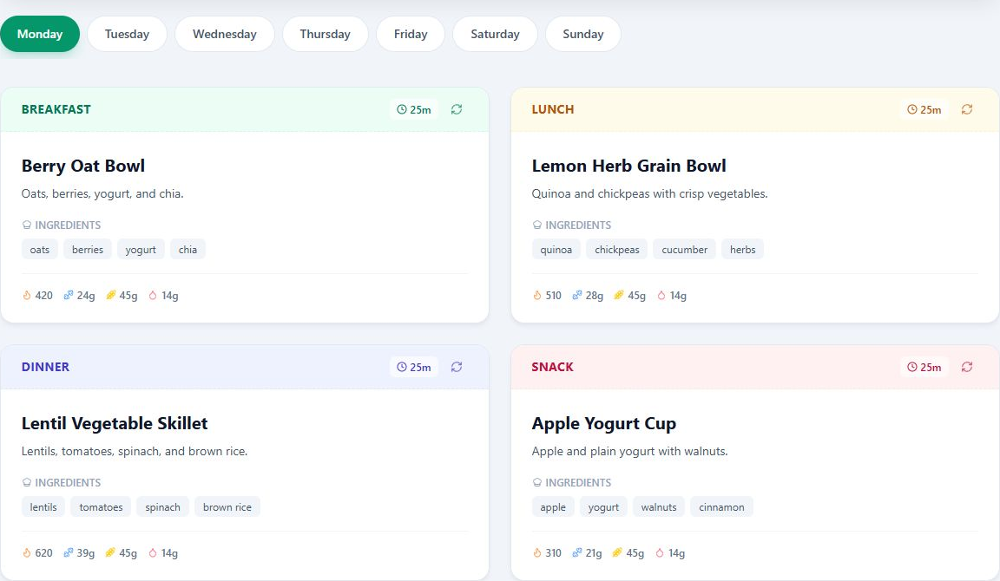

# NeuroNutrition user guide

_For people using the NeuroNutrition beta. This page explains what the product
does, its safety limits, and where to begin._

[Open the NeuroNutrition beta](https://cmilios.github.io/neuro-nutrition/) ·
[Get started](https://github.com/cmilios/neuro-nutrition/wiki/Getting-Started)

NeuroNutrition uses AI-Assisted Meal Planning to propose a seven-day Weekly Plan
from your Health Profile. The beta is still changing, so features and
availability may change without notice.

_Synthetic example only. It contains no real account or Health Profile data._

## Safety comes first

NeuroNutrition provides general meal-planning guidance. It is not medical
advice, diagnosis, or treatment. If you have medical dietary needs, consult a
qualified clinician or dietitian.

Entering an allergy or dietary restriction does not guarantee ingredient
safety. Check every suggested ingredient and product label yourself before
cooking or eating.

## Access your account

Use a sign-in method currently offered on the opening screen. Email and password
access is supported. Google or Apple may also appear while those methods are
available; if a button is absent or marked unavailable, use another offered
method. New email accounts may need confirmation before the first sign-in.

After signing in, the app may ask you to choose a Display Name before loading
your account. Enter the name you want NeuroNutrition to use, then select
**Save** to continue to the Health Profile.

Your signed-in account keeps its Health Profile and Current Weekly Plan separate
from other users. Do not share your password or confirmation and recovery links.

## Build your Health Profile

The Health Profile asks for age, gender, height, weight, optional target weight,
activity level, goal, diet preference, and optional allergy or dislike notes.
These details tailor the Weekly Plan, so review them before generating it.

The Apple Health control is an experimental demonstration in this beta. It does
not connect to a real Apple Health account; enter and verify your details
manually.

Continue with the step-by-step
[Getting Started guide](https://github.com/cmilios/neuro-nutrition/wiki/Getting-Started).

## Need to leave the app?

Use the account menu to log out of the current browser session. On a shared
device, always log out when you finish.
